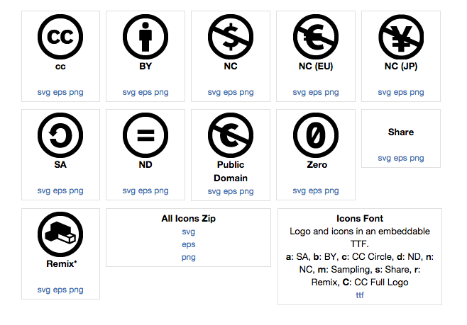

## General Idea: The Effects of Using Open-source Code
I would like to create an easily digestible way to communicate the relationship of OSS with non-OSS code, illustrating how open-source and proprietary code can interact, and the legal effects of those interactions under various open-source licenses.

## Details
Specifically, I hope to both categorize and visually represent the types of worries proprietary code owners have when using or interacting with different types of open-source code bases. My goal is to do for the average programmer's code-license-interaction worries what Creative Commons has done for the average graphic designer's image-licensing worries: give creators easily digestible cues as to the impact of their code use, using both language and visual icons to describe the effects of existing open-source licenses.

## Comparable Creative Commons Categorizations and Visual Representations
### Creative Commons button icons
These icons are applied to individual works in order to describe what creators may do to them under their corresponding Creative Commons licenses. Note that they describe the license; they do not legally constitute a license on their own. Each icon represents several of the most important legal issues involved in copying or using the work to which it is affixed.

### Creative Commons large icons 
Each icon represents a single legal issue, which can be used on its own when discussing that issue or incorporated into a license-descriptor icon like those above.

## Links

* ### Legal assessment
  * https://www.softwarefreedom.org/resources/2014/SFLC-Guide_to_GPL_Compliance_2d_ed.html

* ### Example Icons
  * http://creativecommons.org/about/downloads
  * http://commons.wikimedia.org/wiki/Creative_Commons_icons

* ### Background
  * https://en.wikipedia.org/wiki/GNU_General_Public_License Wikipedia: GNU GPL]
  * https://en.wikipedia.org/wiki/GNU_Lesser_General_Public_License#Choosing_to_license_a_library_under_the_GPL_or_the_LGPL
  * https://wiki.creativecommons.org/CC0_FAQ
  * http://www.markosproject.eu/

* ### For Programmers
  * http://www.fsf.org/licensing/
  * http://www.gnu.org/licenses/license-recommendations.html
  * http://www.gnu.org/licenses/license-list.html
  * http://www.gnu.org/licenses/gpl-faq.html

* ### For Project Managers
  * https://www.clahub.com/
  * http://elinux.org/Developer_Certificate_Of_Origin
  * http://selector.harmonyagreements.org/

* ### For Auditors
  * https://www.blackducksoftware.com/products/black-duck-suite/protex/black-duck-code-label
  * http://sourceauditor.com/blog/tag/lawsuits-on-open-source/
  * http://arstechnica.com/information-technology/2009/05/cisco-settles-fsf-gpl-lawsuit-appoints-compliance-officer/
